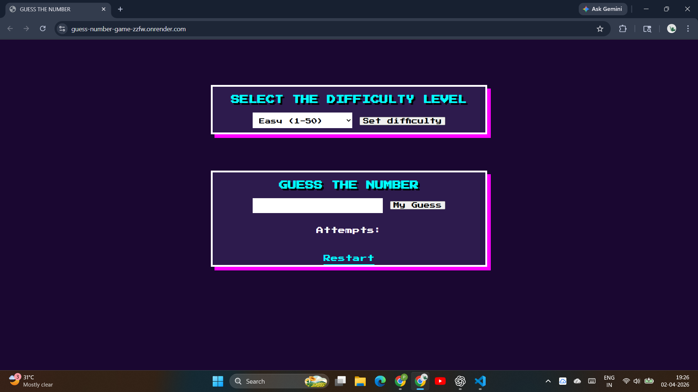

# 🎮 Guess The Number: Neon Edition

A vibrant, retro-inspired web game built with **Python Flask**. Test your intuition and logic by guessing a hidden number within a dynamic range.

### 🔗 [Play the Game Here](https://guess-number-game-zzfw.onrender.com/)

---

## 🕹️ Gameplay Features

* **Adjustable Difficulty:** Choose your challenge level:

  * **Easy:** 1 - 50
  * **Medium:** 1 - 100
  * **Hard:** 1 - 500
* **Live Feedback:** Get real-time hints on whether your guess is too high or too low
* **Attempt Tracker:** Monitor your efficiency with a persistent attempt counter
* **Retro UI:** A custom-styled "Neon-Pixel" interface using the *Press Start 2P* font 🎮

---

## 🛠️ Tech Stack

* **Backend:** [Python](https://www.python.org/) / [Flask](https://flask.palletsprojects.com/)
* **Frontend:** HTML5 & CSS3 (Custom Pixel UI)
* **Deployment:** [Render](https://render.com/)

---

## 📸 Preview



---

## 🚀 Local Installation

Want to run this on your own machine? Follow these steps:

### 1️⃣ Clone the Repository

```bash
git clone https://github.com/your-username/guess-number-game.git
cd guess-number-game
```

---

### 2️⃣ Create Virtual Environment (Recommended)

```bash
python -m venv venv
```

Activate it:

**Windows:**

```bash
venv\Scripts\activate
```

**Mac/Linux:**

```bash
source venv/bin/activate
```

---

### 3️⃣ Install Dependencies

```bash
pip install -r requirements.txt
```

---

### 4️⃣ Run the Application

```bash
python flask_app.py
```

---

### 5️⃣ Open in Browser

```
http://127.0.0.1:5000/
```

---

## 📁 Project Structure

```
guess-number-game/
│── flask_app.py
│── requirements.txt
│── Procfile
│── templates/
│    └── index.html
│── static/ (optional for CSS/images)
│── pic.png
```

---

## 💡 Key Concepts Used

* Flask routing (`GET`, `POST`)
* Session management (state persistence)
* Form handling in web apps
* Dynamic UI rendering with Jinja2
* Deployment using Gunicorn + Render

---

## 🔮 Future Improvements

* 🎵 Add sound effects
* ⏱ Timer-based gameplay
* 🏆 Leaderboard system
* 🎨 Advanced animations (neon glow effects)
* 👤 User login & score tracking

---

## 🤝 Contributing

Contributions are welcome! Feel free to fork this repo and improve the project.

---

## ⭐ Show Your Support

If you liked this project, give it a ⭐ on GitHub!

---
